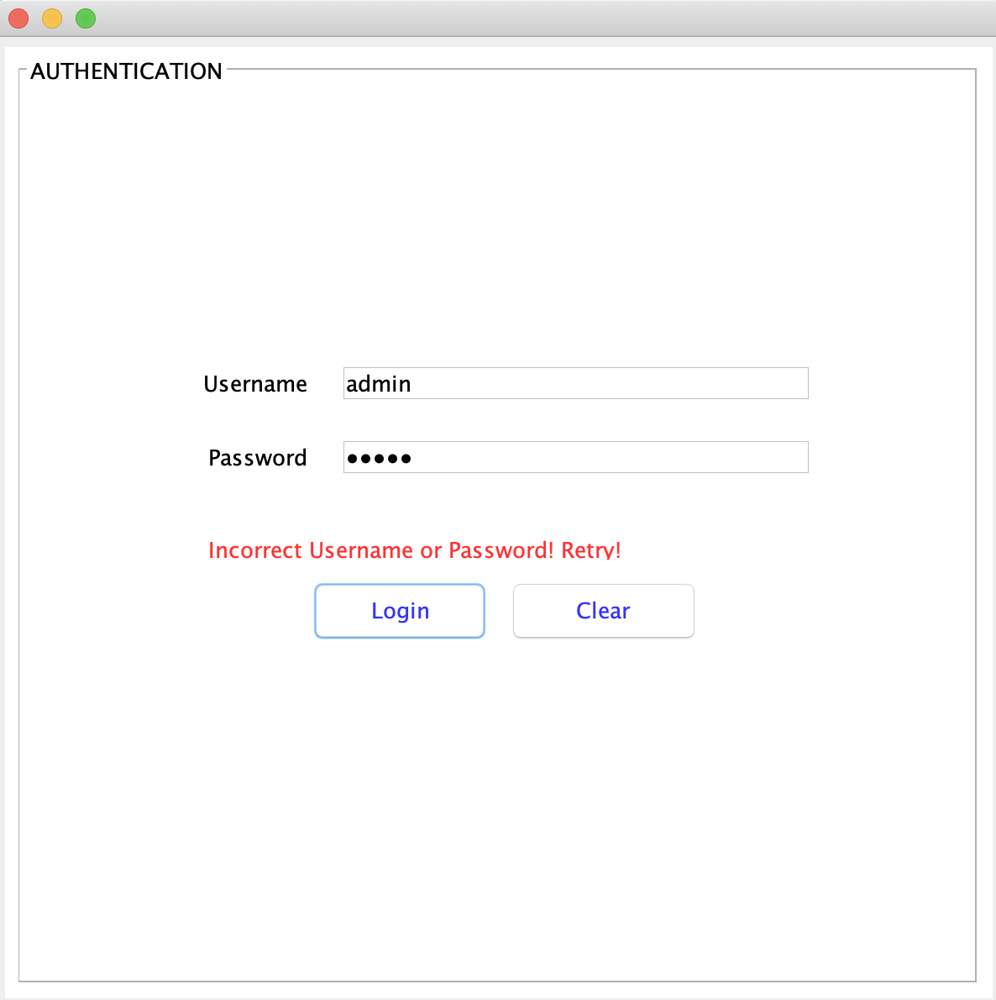
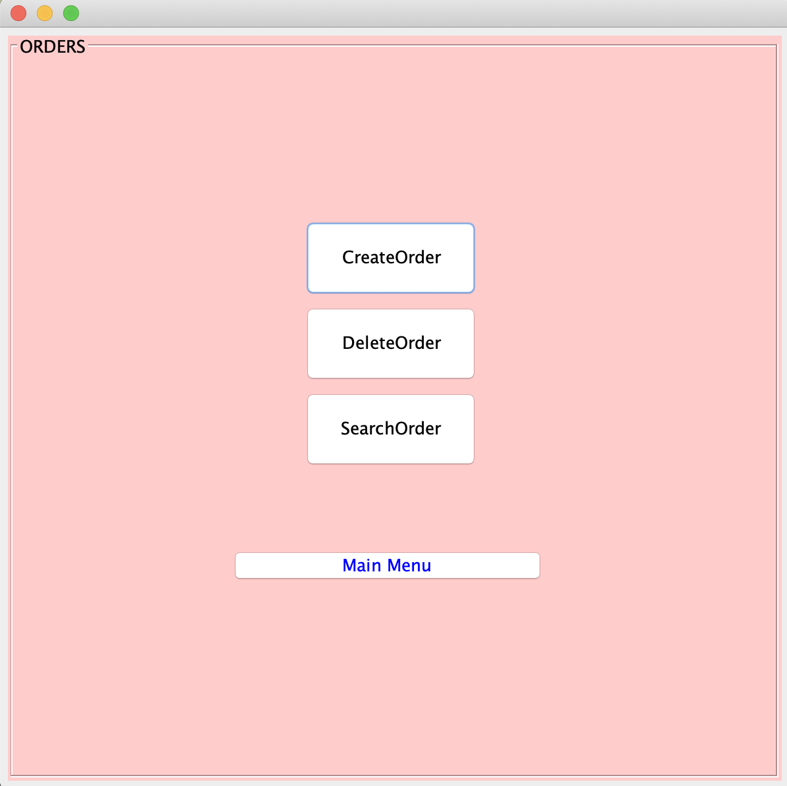
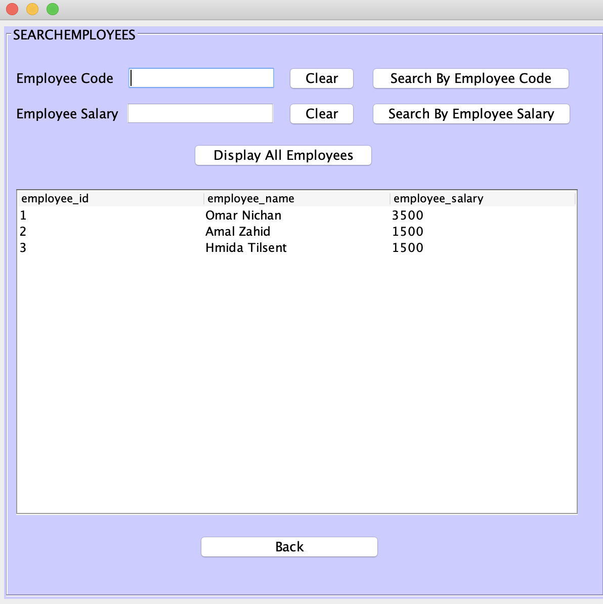

# Crepeto Restaurant Management System (Java Swing, PostgreSQL)

*Crepeto* is a mid-range creperie and restaurant located in Ifrane-Morocco. This project aims to create a *CRUD application* that will automate the management of the restaurant's orders, inventory, billing, and employees.

**To use, you need to:**

- Download this repository
- Download and install the latest Java Development Kit JDK 15. You can download it from the Java SE Development Kit downloads page at: https://www.oracle.com/java/technologies/javase/jdk15-archive-downloads.html
- Download the latest version of JDBC (4.2) https://jdbc.postgresql.org/download.html
- Download and Install Apache NetBeans https://netbeans.apache.org/download/nb121/nb121.html
- Add the Java variable to your path environment
- Add the path of the PostgreSQL JDBC driver to the CLASSPATH environment variable. 

- Set up PostgresSQL database and Create the following tables:
  ```
  CREATE TABLE employee (
  employee_id SERIAL PRIMARY KEY,
  employee_name VARCHAR(255),
  employee_address VARCHAR(255),
  employee_phone VARCHAR(255),
  employee_email VARCHAR(255),
  employee_salary INT
  );
  ```
  
  ```
  CREATE TABLE product (
  product_id SERIAL PRIMARY KEY,
  product_name VARCHAR(255),
  product_quantity INTEGER,
  product_price FLOAT(10)
  );
  ```
  
  ```
  CREATE TABLE orders (
  order_id SERIAL PRIMARY KEY,
  order_name VARCHAR(255),
  order_date DATE,
  order_quantity INTEGER,
  order_price INTEGER,
  product_id INTEGER REFERENCES product(product_id)
  );
  ```
- (Optional) Populate Tables with Data:
  ```
  INSERT INTO Product (product_id, product_name, product_quantity, product_price) VALUES
  (1, 'Twix', 30, 5.00),
  (2, 'Nutella 600g', 10, 71.00),
  (3, 'Kinder Bueno', 36, 10.00),
  (4, 'Milka', 15, 8.00),
  (5, 'Edam 900g', 4, 130.00),
  (6, 'Flour 5kg', 5, 72.00),
  (7, 'Banana 1kg', 6, 13.00);
  ```
  
  ```
  INSERT INTO Employee (employee_id, employee_name, employee_address, employee_phone, employee_email, employee_salary) VALUES
  (1, 'Omar Nichan', 'Ifrane', 0611111111, 'emp1@gmail.com', 3500),
  (2, 'Amal Zahid', 'Ifrane', 0622222222, 'emp2@gmail.com', 1500),
  (3, 'Latifa Kati', 'Ifrane', 0633333333, 'emp3@gmail.com', 4000),
  (4, 'Anass Mahboub', 'Ifrane', 0644444444, 'emp4@gmail.com', 2000);
  ```

**Description of the Functionalities Implemented:**

<ins>AUTHENTICATE</ins>

The user is asked to input his/her username (jTextField) and password (jPasswordField)

- If username or password incorrect, an Error is message is displayed in jLabel: 



- If authentication is successful (username = admin and password = admin), JOptionPane Information Message is displayed and user is directed to Home Page:


<ins>HOME PAGE</ins>

The user can naviguate the CRUD Application and choose to manage (Add/Delete/Search) either orders, products(inventory), employees or go to the billing section of the HOME PAGE.


<ins>ADD</insu>

After clicking on a particular section in the HOME PAGE, we will be directed to a jFrame that looks like this:

(This page show up when we click on the section "Orders")



Now if we want for example to add (create) a new employee, we should:
1. Click on the section "Employees" in the HOME PAGE
2. Select AddEmployee
3. Input Employee Information


4. Click on Save
5. Employee Added!!


<ins>DELETE</ins>

To delete an Employee, we should:
1. Click on the section "Employees" in the HOME PAGE
2. Select DeleteEmployee
3. Input Employee ID


4. Click on Delete
5. Employee Deleted!!


<ins>SEARCH</ins>

To search an Employee, we should:
1. Click on the section "Employees" in the HOME PAGE
2. Select SearchEmployee
3. Search by Employee ID or Employee Salary

| Search Employee (with ID = 3) after Addition | Search Employee (with ID = 3) after Deletion |
| :---: | :---: |
|  |  |

The "Display All Employees" as the name indicates returns a search result with all employees stored in the database.

<ins>COMPUTE REVENUES</ins>

"Compute Revenues" returns the revenues that Crepeto earned from orders 

*Query*
```
 SELECT SUM(order_price * order_quantity) FROM Orders;
```

To compute revenues, we should:
1. Click on the section "Billing" in the HOME PAGE
2. Select CalculateRevenues
3. A message will be displayed highlighting the revenues of Crepeto!


<ins>COMPUTE EXPENSES</ins>

"Compute Expenses" returns the expenses of Crepeto (Inventory products bought + Employees salaries)

*Query*
```
SELECT (SUM(product_price * product_quantity) + (SELECT SUM(employee_salary) FROM Employee)) FROM Product;
```

To compute Expenses, we should:
1. Click on the section "Billing" in the HOME PAGE
2. Select CalculateExpenses
3. A message will be displayed highlighting the expenses of Crepeto!


<ins>COMPUTE NET PROFIT</ins>

In order to compute the Net Profit, we need to compute first the revenues and expenses of Crepeto (Otherwise you get an error message displayed in a jLabel).

Net Profit simply substract expenses from revenues and returns a message!


 
